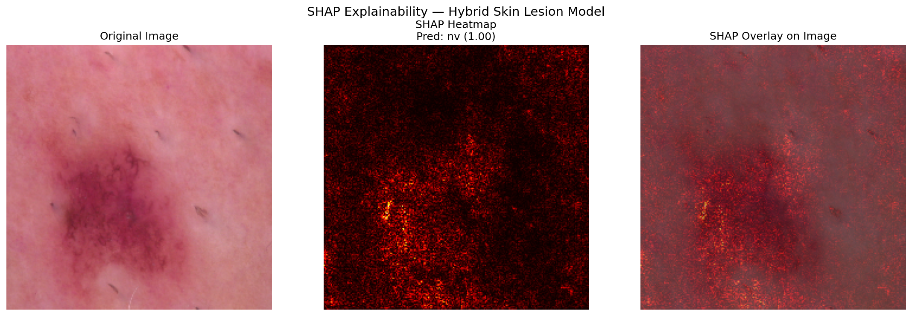

# Skin Lesion Classification — Hybrid Deep Learning with Explainability

## Overview
A hybrid deep learning system for automated skin lesion classification on the HAM10000 dataset. 
Two CNN backbones (ResNet-50 + EfficientNet-B0) are fused to outperform single-model baselines, 
with Grad-CAM and SHAP explainability for clinical interpretability.

## Results

| Model | Test Accuracy |
|---|---|
| Baseline ResNet-50 | 84.36% |
| **Hybrid ResNet-50 + EfficientNet-B0** | **89.75%** |
| Improvement | **+5.39%** |

## Dataset
- **HAM10000** — 10,015 dermatoscopic images, 7 diagnostic classes
- Classes: akiec, bcc, bkl, df, mel, nv, vasc
- Split: 70% train / 15% val / 15% test (stratified)

## Model Architecture
- **Backbone 1**: ResNet-50 (pretrained, ImageNet)
- **Backbone 2**: EfficientNet-B0 (pretrained, ImageNet)
- **Fusion**: Feature concatenation → Linear(256) → ReLU → Dropout(0.3) → Linear(7)
- **Loss**: CrossEntropyLoss
- **Optimizer**: Adam (lr=1e-4), ReduceLROnPlateau scheduler

## Explainability
### Grad-CAM — Model attention on real lesion images

### SHAP — Feature importance overlay

## Project Structure
skin-lesion-hybrid-cnn/
├── data/external/sample_images/   # sample HAM10000 images
├── src/
│   ├── models/architectures.py    # hybrid model definition
│   ├── explainability/
│   │   ├── gradcam.py             # Grad-CAM visualization
│   │   └── shap_explain.py        # SHAP explanation
├── reports/figures/               # paper-ready output figures
└── models/                        # trained model checkpoints

## Live Models (HuggingFace Hub)
- Baseline: [asif-nawaz-ml/skin-lesion-resnet50-ham10000](https://huggingface.co/asif-nawaz-ml/skin-lesion-resnet50-ham10000)
- Hybrid: [asif-nawaz-ml/skin-lesion-hybrid-resnet50-efficientnet](https://huggingface.co/asif-nawaz-ml/skin-lesion-hybrid-resnet50-efficientnet)

## Author
**Asif Nawaz** — Healthcare Data Scientist | ML & AI Researcher  
[GitHub](https://github.com/Asif5588-M) | 
[HuggingFace](https://huggingface.co/asif-nawaz-ml) | 
[LinkedIn](https://linkedin.com/in/asif-nawaz-data-scientist)